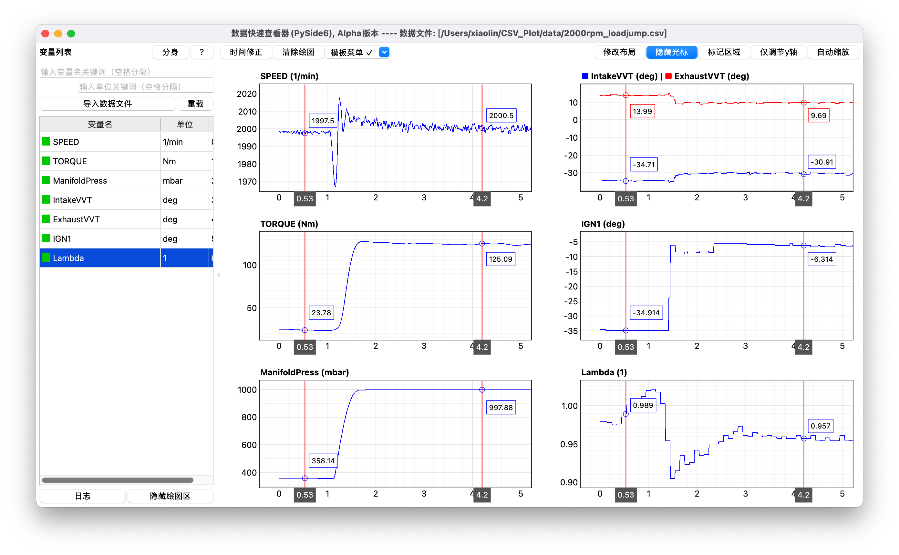

# CSV Plot (PySide6)

一个基于 PySide6 + pyqtgraph 的高性能交互式数据可视化工具，支持 CSV 和 MDF（ASAM MDF4/DAT）格式文件，专为快速加载、浏览和分析时序数据而设计。支持百万级数据点的流畅绘制和多曲线模式。



## 主要特性

### 数据加载与显示
- **多格式支持**: CSV / MDF（.mf4 / .mdf / .dat）、TSV 及兼容格式
- **MDF 专属**: 枚举类型通道自动映射文本标签、多 Channel Group 聚合、跨 Group 同名变量智能后缀
- **拖拽加载**: 直接将文件拖拽到窗口中即可加载
- **智能解析**: CSV 自动检测编码、分隔符、标题行/单位行；MDF 自动识别枚举通道
- **大数据支持**: 后台线程加载，进度显示，支持百万级数据点
- **数据质量指示 (mdf不支持) **:
  - 🟢 绿色：变化的有效数值
  - 🟡 黄色：无变化的有效数值（常数）
  - 🔴 红色：非有效数值
- **快速浏览**: 双击变量名查看详细数值表格

### 强大的图表功能
- **拖拽式绘图**: 从变量列表拖拽变量到绘图区域即可绘图
- **多曲线模式**: 支持在同一图表中同时显示多条曲线，自动颜色分配
- **变量编辑器**: 可视化编辑曲线顺序、颜色、可见性
- **灵活布局**: 支持多子图网格排列（行列数可配置），可自由调整布局
- **同步缩放**: 所有图表 X 轴自动同步（XLink），支持鼠标交互缩放
- **高性能渲染**:
  - 智能降采样（peak 模式保留峰值特征）
  - 交互期间自适应降低样式更新频率
  - 支持百万级数据点流畅绘制
  - 曲线样式自动切换：缩放至细节时自动显示符号点
- **精确控制**:
  - 鼠标滚轮缩放 X 轴（以鼠标位置为中心）
  - 鼠标左键拖拽移动视图
  - 双击中键清除单个图表
  - Ctrl/Shift + 滚轮缩放特定轴
- **右键菜单**: 跳转到数据、自动调节 Y 轴、游标模式、调整行高等
- **坐标轴设置**: 双击坐标轴标签可设置范围/刻度

### 游标与交互功能
- **十字游标**: 实时显示当前鼠标位置的 X/Y 坐标值
- **多游标模式**: 1 个自由游标 / 1 个锚定游标 / 2 个锚定游标
- **多曲线游标**: 在多曲线模式下同时显示所有曲线在当前 X 位置的值
- **MDF 枚举游标**: 枚举通道自动显示文本标签而非原始整数值
- **同步游标**: 多个图表之间的游标位置自动同步
- **交互优化**: 缩放/拖动期间自动禁用游标更新

### 标记与统计分析
- **区间标记**: 在图表上标记感兴趣的数据区间
- **自动统计**: 实时计算标记区域的统计值（最小/最大/平均值/斜率等）
- **标记统计窗口**: 汇总显示所有图表的标记统计信息

### 智能数据表格
- **快速访问**: 双击变量名或点击「Jump to Data」打开表格
- **冻结列功能**: 支持列冻结，方便对比查看
- **智能高亮**: 选中单元格高亮 + 所在行/列浅蓝高亮
- **XY 散点图**: 选中两列数据可快速绘制散点图
- **同步滚动**: 冻结列与非冻结列保持同步

## 项目结构

```
csv_plot/
├── csv_plot.py                  # 主入口（~5000 行，DraggablePlotWidget + MainWindow）
├── README.md
├── assets/                      # 图标资源
│   ├── icon.png
│   ├── icon.ico
│   └── icon.icns
└── src/                         # 模块化源码
    ├── app/
    │   └── plot_context.py      # PlotContext 服务层（依赖注入）
    ├── core/
    │   ├── config.py            # 全局常量、float32 安全检查
    │   ├── data_types.py        # AutoDetectError / FormatInfo / CurveInfo 数据类型
    │   ├── curve_strategy.py    # 曲线策略（单/多曲线模式切换）
    │   ├── scheduler.py         # UnifiedUpdateScheduler 防抖调度器
    │   ├── font_cache.py        # 字体缓存（基于 AppSettings）
    │   ├── logger.py            # Logger 日志管理器
    │   ├── settings.py          # AppSettings 统一配置管理器 + ConfigKey 枚举
    │   ├── plot_config.py       # PlotSessionConfig / PlotConfig 配置模型
    │   ├── template_models.py   # PlotTemplate / TemplateMetadata 模板数据模型
    │   ├── storage.py           # TemplateStorage 模板持久化存储
    │   ├── template_manager.py  # TemplateManager 模板 CRUD 管理
    │   └── auto_save_manager.py # AutoSaveManager 自动保存与恢复
    ├── data/
    │   ├── loader.py            # FastDataLoader CSV 加载 + DataLoadThread 后台线程
    │   ├── mdf_lazy_loader.py   # MDFLazyLoader MDF4/DAT 按需加载 + LRU 缓存
    │   └── metadata.py          # VarMetadata 数据类 + 有效性分类工具
    ├── utils/
    │   └── paths.py             # resource_path 资源路径解析
    └── ui/
        ├── main_window.py       # MainWindow 主窗口（QSettings 重构已接入 AppSettings）
        ├── drag_drop.py         # 拖放解析（parse_var_names / build_mimedata / create_pixmap）
        ├── table_dialog.py      # DataTableDialog + PandasTableModel + CustomDelegate + XYScatterPlotDialog
        ├── variable_list.py     # MyTableWidget 变量列表面板
        ├── mark_stats.py        # MarkStatsWindow 标记统计窗口
        ├── plot_config_manager.py  # PlotConfigManager 配置协调（模板 / 自动保存入口）
        ├── plot_variable_editor.py  # PlotVariableEditorDialog 变量编辑器
        ├── main_window_base_manager.py  # MainWindow 基础管理器
        ├── file_loader_manager.py  # 文件加载管理器
        ├── cursor_sync_manager.py  # 游标同步管理器
        ├── layout_manager.py    # 布局管理器
        ├── splash_screen.py     # SplashScreen 启动画面
        ├── dialogs/
        │   ├── help.py          # HelpDialog 帮助文档
        │   ├── layout_input.py  # LayoutInputDialog 行列数配置
        │   ├── axis.py          # AxisDialog 坐标轴设置
        │   ├── time_correction.py  # TimeCorrectionDialog 时间修正
        │   ├── log_window.py    # LogWindow 日志窗口（QSettings 重构已接入 AppSettings）
        │   ├── template_editor_dialog.py  # TemplateEditorDialog 模板编辑器
        │   └── template_manager_dialog.py # TemplateManagerDialog 模板管理器
        └── widgets/
            ├── __init__.py
            ├── base_manager.py  # 管理器基类
            ├── custom_viewbox.py # 信号化 CustomViewBox（10 个信号解耦 MainWindow）
            ├── plot_widget.py   # PlotWidget 主绘图组件
            ├── plot_container.py # PlotContainerWidget 绘图容器
            ├── plot_ui_manager.py # PlotUIManager 绘图 UI 管理器
            ├── plot_data_manager.py # PlotDataManager 绘图数据管理器
            ├── axis_manager.py  # AxisManager 坐标轴管理器
            ├── cursor_manager.py # CursorManager 游标管理器
            ├── multi_curve_manager.py # MultiCurveManager 多曲线管理器
            ├── mark_region_manager.py # MarkRegionManager 标记区域管理器
            ├── event_handler.py # EventHandler 事件处理器
            └── log_viewer.py    # LogViewer 日志查看器
```

## 快速开始

### 系统要求
- Python 3.12 或更高版本
- 支持的操作系统：Windows、macOS、Linux
- pyqtgraph 建议 0.14.0 以上

### 安装步骤

1. **克隆仓库**
   ```bash
   git clone https://github.com/Melon793/csv_plot.git
   cd csv_plot
   ```

2. **安装依赖**（使用 uv）
   ```bash
   uv sync
   ```

   或使用 pip：
   ```bash
   pip install pyside6 pyqtgraph pandas numpy asammdf charset-normalizer ujson
   ```

3. **运行程序**
   ```bash
   uv run csv_plot.py
   ```

### 打包为独立应用

项目提供了 `scripts/` 目录下的打包脚本，可直接运行：

```bash
# PyInstaller（单目录模式，启动快）
bash scripts/build_exe_pyinstaller

# Nuitka（编译为原生可执行文件，性能更高）
bash scripts/build_exe_nuitka

# 打包为独立应用（Windows）
uv run scripts/build_win.py 
```

## 使用指南

见 [docs/help.md](docs/help.md)

### MDF 文件特别说明

| MDF 特性 | 支持方式 |
|----------|---------|
| 多 Channel Group | 自动聚合，同名变量加 `_G{index}` 后缀区分 |
| 枚举类型通道 | 自动构建 `{int→text_label}` 映射，绘图和游标显示文本标签 |
| 时间序列 | 自动提取时间通道作为 X 轴（`t` / `time` / `timestamp`） |
| asammdf 兼容 | 支持 7.x 和 8.x 两种 API |


## 技术栈

- **PySide6** — 现代化图形界面框架（LGPL 许可）
- **pyqtgraph** — 高性能科学绘图库
- **pandas** — 数据分析库
- **numpy** — 数值计算基础库
- **asammdf** — ASAM MDF 文件解析
- **charset-normalizer** — 字符编码检测
- **ujson** — 高性能 JSON 处理

## 支持与反馈

如果您在使用过程中遇到问题或有改进建议，欢迎：

- 提交 Issue: [GitHub Issues](https://github.com/Melon793/csv_plot/issues)
- 参与讨论: [GitHub Discussions](https://github.com/Melon793/csv_plot/discussions)
- 给项目点赞: [GitHub Star](https://github.com/Melon793/csv_plot)

## 许可证

本项目采用开源许可证，供学习与研究使用。欢迎自由修改和扩展。

---

**如果这个项目对您有帮助，请给我们一个 Star！**
